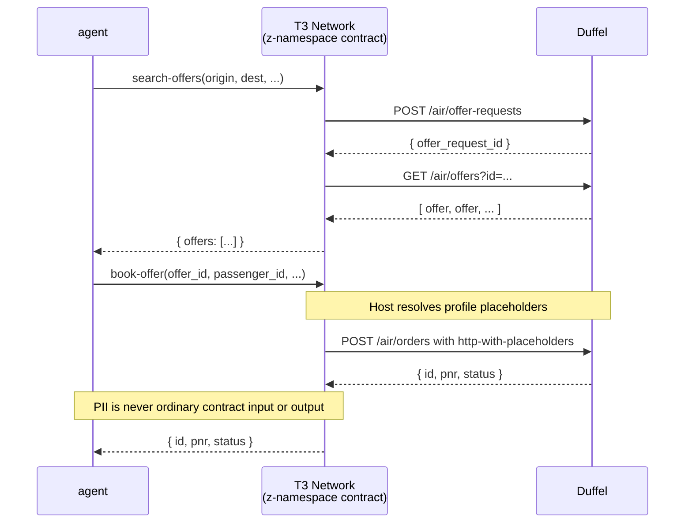

# z-tenant-flight

Duffel flight booking showcase for Trinity z-namespace tenants — v0.4.1.

A Rust WASM contract that runs inside the Trinity TEE (Trusted Execution Environment) and calls the [Duffel](https://duffel.com) API synchronously via `host:interfaces/http`.

## What this is

Two contract functions exposed over WIT:

| Function | What it does |
|---|---|
| `search-offers` | POST to Duffel `/air/offer-requests`, then GET `/air/offers` — returns a list of available flights |
| `book-offer` | POST to Duffel `/air/orders` using host-resolved profile placeholders — returns the booking ID and PNR |

Privacy guarantee: passenger PII is not passed as ordinary contract input. The contract writes `{{profile.<field>}}` markers into the Duffel order body and sends it through `host:interfaces/http-with-placeholders`; the host resolves those markers from the calling user's profile at dispatch time. Only the booking ID and PNR cross the WIT boundary back to the caller. Error responses from Duffel are logged inside the TEE and never forwarded to the caller.

## Host capabilities

Capabilities come from the host interfaces imported in `wit/world.wit`; there is no separate contract manifest in the current registration flow. This sample imports:

- `host:tenant/tenant-context@1.0.0`
- `host:interfaces/logging@2.1.0`
- `host:interfaces/kv-store@2.1.0`
- `host:interfaces/http@2.1.0`
- `host:interfaces/http-with-placeholders@2.1.0`

## Setup: providing the Duffel API key

Before deploying or calling this contract for the first time, the tenant SDK must:

1. Register the contract and keep the returned `contract_id`.
2. Create the `secrets` KV map in the z: namespace with this contract as reader and writer.
3. Write the Duffel API key under the key `duffel_api_key` with a control-plane `map-entry-set` call.

```typescript
await tenant.maps.create({
  tail: "secrets",
  visibility: "private",
  writers: { only: [contractId] },
  readers: { only: [contractId] },
});

await tenant.executeControl("map-entry-set", {
  map_name: tenant.canonicalName("secrets"),
  key: "duffel_api_key",
  value: process.env.DUFFEL_API_KEY!,
});
```

The contract reads this value at runtime from `z:<tid>:secrets` using `host:interfaces/kv-store` — no `secret` interface is involved. The `secrets` map is owned and populated externally by the tenant operator; the contract never writes to it.

## Building

```bash
rustup target add wasm32-wasip2
cargo build --target wasm32-wasip2 --release
```

The WASM artefact will be at `target/wasm32-wasip2/release/z_tenant_flight.wasm`.

## Running tests (native)

```bash
cargo test --lib
cargo clippy --all-targets -- -D warnings
```

## Contract functions

### `search-offers`

```wit
search-offers: func(req: generic-input) -> result<list<u8>, string>;
```

Input:

```json
{
  "origin": "LHR",
  "destination": "JFK",
  "departure_date": "2026-07-15",
  "cabin_class": "economy",
  "adult_count": 1
}
```

Returns a list of `offer` records, each with `id`, `total_amount`, `total_currency`, and `expires_at`.

### `book-offer`

```wit
book-offer: func(req: generic-input) -> result<list<u8>, string>;
```

Input:

```json
{
  "offer_id": "off_abc123",
  "passenger_id": "pas_abc123",
  "total_amount": "199.00",
  "total_currency": "GBP"
}
```

Passenger name, date of birth, gender, and verified email are resolved host-side from profile placeholders in `src/booking.rs`; they are not supplied in this JSON input.

Returns `{ "id": "ord_...", "pnr": "ABC123", "status": "confirmed" }`.

## Architecture


